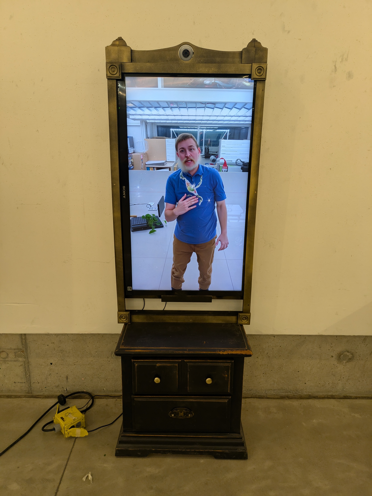
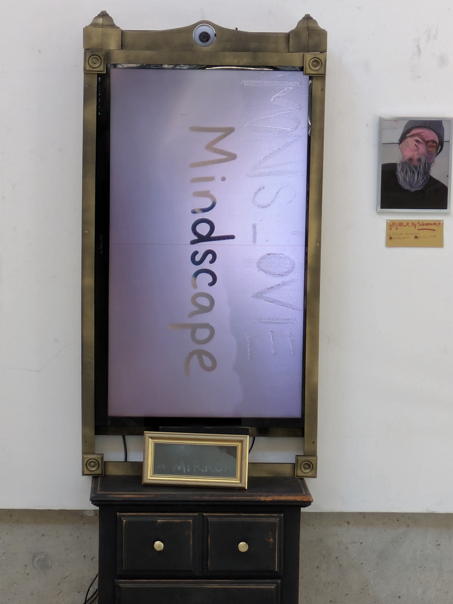

# aMiRRoRMySubconscious: An Interactive AI Experience

**Interactive AI Mirror Designed by DDisArteDD Studios**

## Project Statement

aMiRRoR is an interactive art installation that redefines the concept of reflection. Using real-time AI image processing, aMiRRoR captures a viewer's image and transforms it before displaying an altered version back on an LCD screen—turning a traditional mirror into a portal of self-exploration. See images from the [exhibition in the Beckham Forum](https://photos.google.com/share/AF1QipNUr9BYpaATZitNYJko89mUyurav565MYMcF1k2PxpekZvOGj6pMhTUbeYuwGPBAg?pli=1&key=OWtQMmFweTBBUlpzaW4wQWFfb08wR0oxTWZHSk93) at Iowa State University.

## Concept

At its core, aMiRRoR challenges the boundaries between reality, perception, and identity. Instead of a static, unfiltered reflection, users are presented with a dynamic and evolving version of themselves—one shaped by artificial intelligence, generative algorithms, and artistic interpretation. By integrating real-time AI image to image generation using fine-tuned Flux LoRa models with billions of parameters, aMiRRoR offers unique, unpredictable visual transformations, shifting between surreal, abstract, and hyperreal interpretaitons of the viewer.

This project invites participants to question the nature of self-image and perception in an era of deep fakes, digital identity, and machine creativity. How do we recognize ourselves when our reflection is no longer fixed? What does it mean when an AI interprets us in real time? What does it see "when the mirror dreams of being you"?

Using found and repurposed materials in its construction, aMiRRoR also embodies the philosophy of DDisArteDD—turning discarded technology and objects into an immersive artistic experience. It blurs the line between art, technology, and identity, encouraging viewers to see themselves—and the world—through a transformed lens.

## Artist Research
[unStable Mirror](https://aid-lab.hfg-gmuend.de/articles/unstable-mirror/) by Christopher Pietsch

[Uncanny Mirror](https://quasimondo.com/2020/08/29/uncanny-mirror/) by Mario Klingemann

[Memories of Passersby I](https://quasimondo.com/2018/12/29/memories-of-passersby-i/) by Mario Klingemann

## Concept Images and Ideation (ChatGPT)

[Ideation was done using ChatGPT](docs/aMiRROR_%20An%20Interactive%20AI%20Mirror%20Experience.pdf) including concept images, ideas on technology stacks, and more.

| | |
|:---:|:---:|
|  |  |
|  |  |

## Documentation Images

| | |
|:---:|:---:|
|  |  |
|  |  |
|  |  |
|  |  |
|  |  |
|  |  |
|  |  |
|  |  |
|  |  |
|  | |

## About DDisArteDD

    
    

        DDisArteDD is a creative studio founded by Creative Technologist Dan DeGeest (DD), dedicated to blending traditional assemblage and environmental art with technology, AI, sound, and interactive media. By repurposing found objects and discarded materials, the studio fuses physical and digital elements, integrating microcontrollers, real-time data, and generative AI to push the boundaries of what art can be. Sculptural reliefs, site-specific installations, and mixed-media compositions come to life through dynamic layering, light, and motion, creating immersive experiences that challenge perceptions of waste, value, and transformation.
    

"Transforming the discarded into the DDisArteDD"

