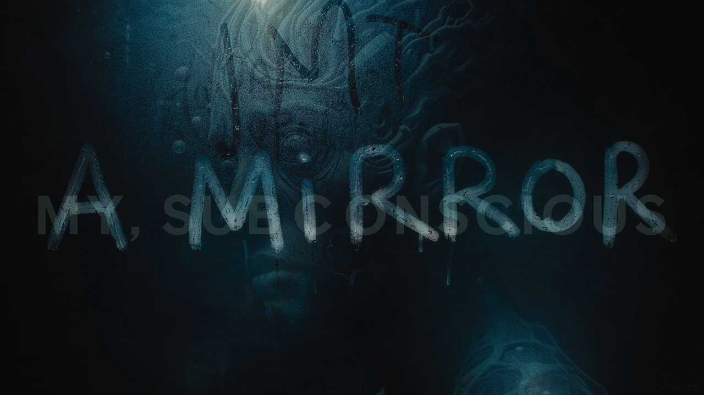
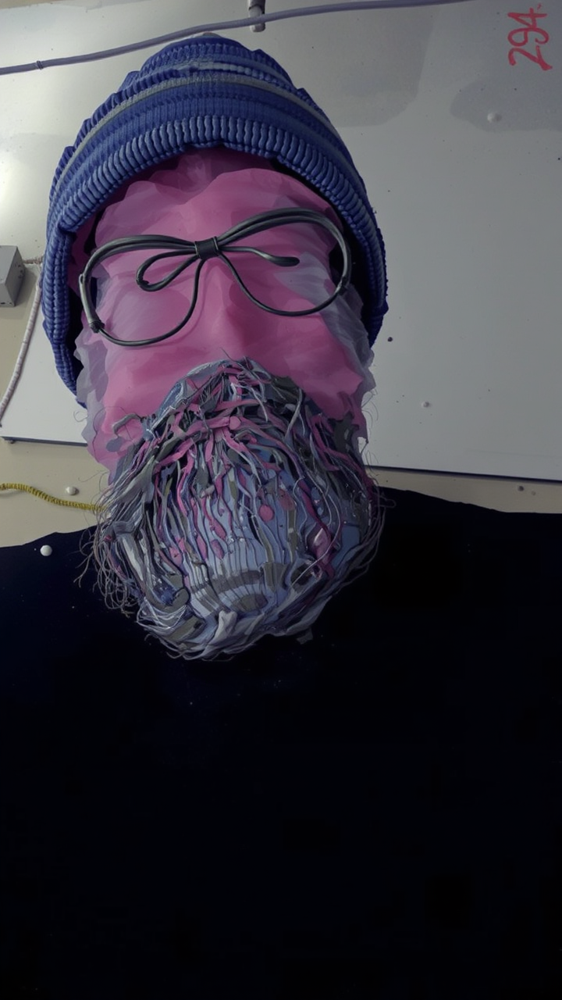
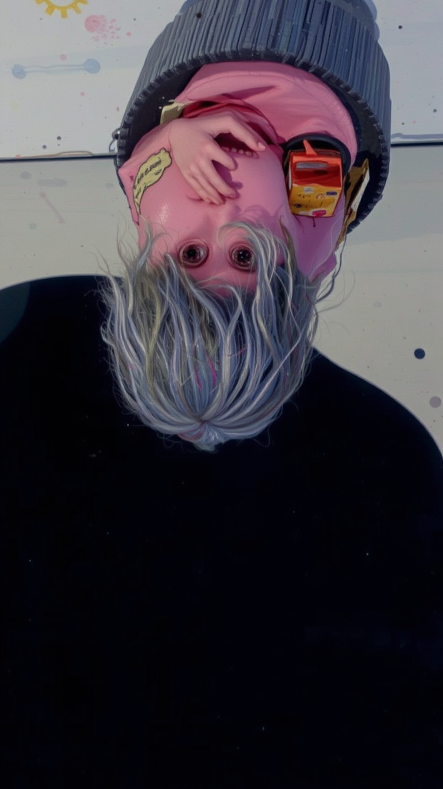

# aMiRROR - Interactive AI Mirror



aMiRROR is an interactive Processing sketch that uses AI to transform your self-portrait into artistic interpretations. It captures your image through a webcam and processes it using various AI models to create unique, artistic representations.

## Requirements

### Processing Libraries
- **Video Library**
  - Open Processing
  - Go to Sketch > Import Library > Add Library
  - Search for "Video"
  - Install "Video | GStreamer-based video library for Processing" by The Processing Foundation

### Java Version
The sketch requires **Java 11 or newer** as it uses Java's built-in HTTP client.

To check your Java version in Processing:
1. Open Processing
2. Go to Help > About Processing
3. It should show which Java version is being used

If you need to update Java, download the latest JDK from [Oracle](https://www.oracle.com/java/technologies/downloads/) or [OpenJDK](https://adoptium.net/).

After installing the Video library and ensuring you have Java 11+, restart Processing and open the aMiRROR.pde sketch.

## Example Outputs

<div style="display: flex; flex-wrap: wrap; justify-content: center; gap: 20px;">
  
  
  
</div>

## Features

- Real-time webcam capture
- Motion detection for automatic capture
- Multiple AI model support
  - [mysubconscious](https://replicate.com/fofr/mysubconscious)
  - [klingon](https://replicate.com/fofr/klingon)
  - [neo-impressionism](https://replicate.com/fofr/neo-impressionism)
  - [condensation](https://replicate.com/fofr/condensation)
  - [weird](https://replicate.com/fofr/weird)
  - [spittingimage](https://replicate.com/fofr/spittingimage)
  - [jameswebb](https://replicate.com/fofr/jameswebb)
  - [cyberpunk](https://replicate.com/fofr/cyberpunk)
- Customizable prompts and parameters
- Fullscreen mode support
- Automatic image saving
- Interactive controls

## Setup

### Processing Sketch Setup

1. Clone this repository
2. Open `aMiRROR.pde` in Processing
3. Install required Processing libraries:
   - Video (for webcam support)

### Flask Server Setup

The sketch requires a Flask server to communicate with the Replicate API.

1. Install Python dependencies:
   ```
   pip install -r requirements.txt
   ```
2. Copy `.env.example` to `.env` and add your Replicate API token:
   ```
   cp .env.example .env
   ```
3. Edit `.env` and add your Replicate API token

## Running the Application

1. Start the Flask server:
   ```
   python app.py
   ```
   The server will run on http://localhost:5000 by default.

2. Run the Processing sketch in Processing IDE

## Controls

- `SPACE`: Toggle between camera and AI view
- `S`: Force a new capture
- `P`: Cycle to next prompt
- `F`: Toggle image flipping
- `M`: Cycle through available models
- `R`: Toggle random prompt mode
- `C`: Switch capture mode (Timer/Motion)
- `D`: Toggle status display visibility
- `G`: Toggle fast mode
- `TAB`: Toggle settings panel
- `[`/`]`: Adjust motion threshold
- `1-9`: Set prompt strength (0.1-0.9)
- `+`/`-`: Fine-tune prompt strength
- `UP`/`DOWN`: Adjust inference steps
- `LEFT`/`RIGHT`: Adjust guidance scale
- `L`/`K`: Adjust lora scale

## Technical Details

### Processing Sketch

The sketch uses:
- Webcam capture for real-time video
- Motion detection for automatic triggering
- Base64 encoding for image transmission
- Multi-threading for API communication
- Memory-optimized image processing

### Flask Server

The server provides these endpoints:

#### POST /generate
Generate an image using the fofr/flux-my-subconscious model.

**Request Body:**
```json
{
  "prompt": "Your prompt text",
  "width": 720,
  "height": 1280,
  "image": "base64_encoded_image"
}
```

**Response:**
```json
{
  "success": true,
  "output_url": "https://replicate.delivery/..."
}
```

#### GET /health
Health check endpoint.

**Response:**
```json
{
  "status": "healthy"
}
```

## Example Usage

Using curl:
```bash
curl -X POST http://localhost:5000/generate \
  -H "Content-Type: application/json" \
  -d '{
    "prompt": "The words \"YOUR_PROMPT\" on a steamed over mirror",
    "width": 720,
    "height": 1280,
    "image": "data:image/png;base64,..."
  }'
```

## Requirements

- Processing 4.x
- Python 3.x
- Webcam
- Replicate API token
- Internet connection

## License

MIT License 
