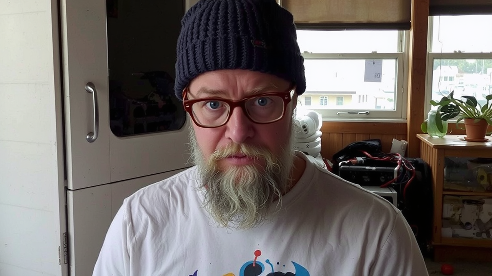

# aMiRROrMySubconscious? - Interactive AI Mirror


aMiRROR is an interactive Processing sketch that uses AI to transform your self-portrait into artistic and/or weird AI interpretations. It captures your image through a webcam and processes it using various AI image to image fine tuned LORA models to create unique, artistic representations.

This project will be used for an art installation titled [aMiRRoRMySubconscious](DDisArteDD.md), featuring a simulated mirror using an LCD panel mounted in a gilded frame. The installation will capture and process the portraits of onlookers in real-time, transforming their reflections into AI-generated artistic interpretations. The piece explores the intersection of technology, art, and human perception, creating a dynamic and interactive experience that challenges our understanding of self-reflection in the digital age.

Special thanks to [@fofr_ai](https://www.threads.net/@fofr_ai) for the detailed explanation of fine tuning LORA models on [Replicate.com](https://replicate.com/fofr) and for the models used in this project.

This project was built with the help of [Cursor](https://cursor.sh), an AI-powered IDE that made development and debugging a breeze. 🚀 *high five* ✋

## Requirements

### Processing Libraries
- **Video Library**
  - Open Processing
  - Go to Sketch > Import Library > Add Library
  - Search for "Video"
  - Install "Video | GStreamer-based video library for Processing" by The Processing Foundation

### Java Version
The sketch requires **Java 11 or newer** as it uses Java's built-in HTTP client.

To check your Java version in Processing:
1. Open Processing
2. Go to Help > About Processing
3. It should show which Java version is being used

If you need to update Java, download the latest JDK from [Oracle](https://www.oracle.com/java/technologies/downloads/) or [OpenJDK](https://adoptium.net/).

After installing the Video library and ensuring you have Java 11+, restart Processing and open the aMiRROR.pde sketch.

## Test Outputs

<div style="display: grid; grid-template-columns: repeat(2, 1fr); gap: 20px; margin-bottom: 20px;">
  
  <div style="display: grid; grid-template-columns: repeat(2, 1fr); gap: 20px;">
    
    
  </div>
</div>

<div style="display: grid; grid-template-columns: repeat(6, 1fr); gap: 10px; margin-top: 20px;">
  
  
  
  
  
  
  
  
  
  
  
  
  
  
  
  
  
  
  
  
  
  
  
  
  
  
  
  
  
  
  
  
  
  
  
  
  
  
  
  
</div>

## Features

- Real-time webcam capture
- Motion detection for automatic capture
- Multiple AI model support
  - [My Subconscious](https://replicate.com/fofr/flux-my-subconscious)
  
    
  - [Nobel](https://replicate.com/fofr/flux-nobel-prize-2024-sketch)
  
    
  - [Neo-Impressionism](https://replicate.com/fofr/flux-neo-impressionism)
  
    
  - [Condensation](https://replicate.com/fofr/flux-condensation)
  
    
  - [Weird](https://replicate.com/fofr/flux-weird)
  
    
  - [Spitting Image](https://replicate.com/fofr/flux-spitting-image)
  
    
  - [James Webb](https://replicate.com/fofr/flux-jwst)
  
    
  - [Cyberpunk](https://replicate.com/fofr/flux-80s-cyberpunk)
  
    
- Customizable prompts and parameters
- Fullscreen mode support
- Automatic image saving
- Interactive controls

## Setup

### Processing Sketch Setup

1. Clone this repository
2. Open `aMiRROR.pde` in Processing
3. Install required Processing libraries:
   - Video (for webcam support)

### Flask Server Setup

The sketch requires a Flask server to communicate with the Replicate API.

1. Install Python dependencies:
   ```
   pip install -r requirements.txt
   ```
2. Copy `.env.example` to `.env` and add your Replicate API token:
   ```
   cp .env.example .env
   ```
3. Edit `.env` and add your Replicate API token

## Running the Application

1. Start the Flask server:
   ```
   python app.py
   ```
   The server will run on http://localhost:5000 by default.

2. Run the Processing sketch in Processing IDE

## Controls


- `SPACE`: Toggle between camera and AI view
- `S`: Force a new capture
- `P`: Cycle to next prompt
- `F`: Toggle image flipping
- `M`: Cycle through available models
- `R`: Toggle random prompt mode
- `C`: Switch capture mode (Timer/Motion)
- `D`: Toggle status display visibility
- `G`: Toggle fast mode
- `TAB`: Toggle settings panel
- `[`/`]`: Adjust motion threshold
- `1-9`: Set prompt strength (0.1-0.9)
- `+`/`-`: Fine-tune prompt strength
- `UP`/`DOWN`: Adjust inference steps
- `LEFT`/`RIGHT`: Adjust guidance scale
- `L`/`K`: Adjust lora scale

## Technical Details